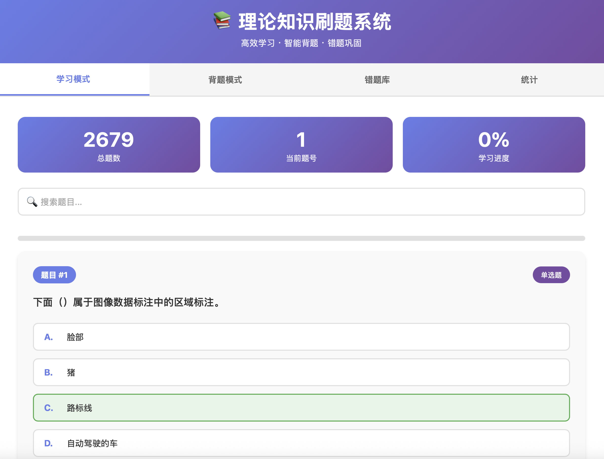
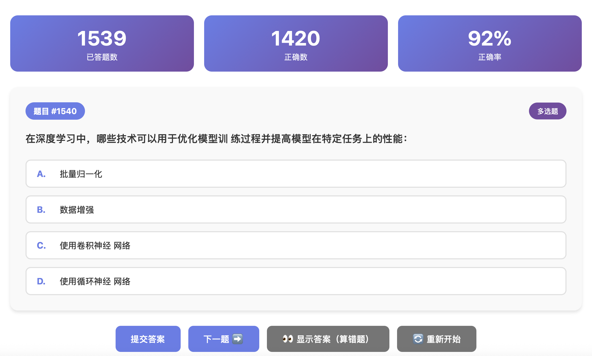
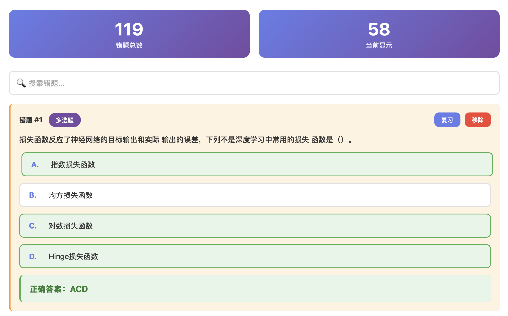

# 📚 QuizMaster | 智慧刷题系统

<div align="center">

**A Modern, Intelligent Quiz System for Efficient Learning**  
**现代化的智能刷题系统，助你高效学习**

[](https://opensource.org/licenses/MIT)
[](https://www.python.org/)
[](https://developer.mozilla.org/en-US/docs/Web/HTML)
[](https://developer.mozilla.org/en-US/docs/Web/JavaScript)

</div>

---

## 🌟 项目简介 | Introduction

**QuizMaster（智慧刷题系统）** 是一个功能完善、界面美观的Web刷题系统，专为理论知识学习而设计。系统支持多种学习模式，智能错题管理，实时学习统计，帮助用户高效掌握知识要点。

**QuizMaster (Smart Quiz System)** is a feature-rich, beautifully designed web-based quiz system specifically designed for theoretical knowledge learning. The system supports multiple learning modes, intelligent error tracking, and real-time learning statistics to help users efficiently master key knowledge points.

### 📸 界面预览 | Screenshots

<div align="center">

#### 学习模式 | Study Mode


#### 背题模式 | Practice Mode


#### 错题库 | Wrong Questions Bank


</div>

### ✨ 核心特性 | Key Features

- 📖 **学习模式** - 浏览题库，自动显示正确答案，支持快速导航和搜索
- 🎯 **背题模式** - 智能出题，30%概率优先复习错题，支持单选/多选
- 📝 **错题库管理** - 自动收集错题，答对3次自动移除，支持手动管理
- 📊 **学习统计** - 实时跟踪学习进度、正确率等关键指标
- 🎨 **现代化UI** - 渐变设计，响应式布局，完美适配桌面和移动端
- ⌨️ **快捷键支持** - 丰富的键盘快捷键，提升操作效率
- 💾 **本地存储** - 数据保存在浏览器本地，保护隐私
- 🔄 **题库更新检测** - 自动检测题库变更，确保数据一致性

---

## 📋 目录 | Table of Contents

- [快速开始](#-快速开始--quick-start)
- [功能详解](#-功能详解--features)
- [快捷键说明](#️-快捷键说明--keyboard-shortcuts)
- [项目结构](#-项目结构--project-structure)
- [技术栈](#-技术栈--tech-stack)
- [使用说明](#-使用说明--usage)
- [数据存储](#-数据存储--data-storage)
- [常见问题](#-常见问题--faq)
- [贡献指南](#-贡献指南--contributing)
- [许可证](#-许可证--license)

---

## 🚀 快速开始 | Quick Start

### 环境要求 | Requirements

- Python 3.6+ (推荐 3.7+)
- 现代浏览器（Chrome、Firefox、Safari、Edge）

### 安装步骤 | Installation

1. **克隆项目** | Clone the repository

```bash
git clone https://github.com/your-username/QuizMaster.git
cd QuizMaster
```

2. **启动服务器** | Start the server

```bash
python 启动服务器.py
```

3. **访问系统** | Access the system

服务器启动后，会自动在浏览器中打开 `http://localhost:9000/index.html`

如果需要在手机等移动设备上访问：
- 确保设备与电脑连接同一WiFi
- 在浏览器中输入显示的局域网IP地址（如：`http://192.168.1.100:9000`）

### 直接打开（不推荐）| Direct Open (Not Recommended)

> ⚠️ **注意**：某些浏览器可能因安全策略无法直接加载JSON文件，建议使用Python服务器。

---

## 📖 功能详解 | Features

### 1. 📚 学习模式 | Study Mode


- **浏览所有题目**：按顺序浏览完整题库，自动显示正确答案
- **智能导航**：支持上一题/下一题，随机跳转，搜索定位
- **进度跟踪**：实时显示当前题号和总体学习进度
- **错题标记**：可以将当前题目手动加入错题库

**使用场景**：初次学习、系统复习、快速查找

### 2. 🎯 背题模式 | Practice Mode


- **智能出题算法**：
  - 30%概率优先从错题库出题
  - 避免短时间内重复出现相同题目
  - 优先推送未做过的题目
  - 防饿死机制：连续6题未出错题时，强制出错题
  
- **题目类型支持**：
  - 单选题：选择后自动提交并显示答案
  - 多选题：支持多选，需点击"提交答案"按钮

- **自动错题管理**：
  - 答错自动加入错题库
  - 错题答对3次自动从错题库移除
  - 实时更新统计信息

- **实时反馈**：
  - 选择后立即显示正确答案
  - 错误选项红色高亮，正确选项绿色高亮
  - 1秒后自动跳转下一题

**使用场景**：考前练习、巩固复习、模拟考试

### 3. 📝 错题库 | Wrong Questions Bank


- **自动收集**：答错或点击"显示答案"的题目自动加入
- **智能管理**：
  - 错题答对3次自动移除
  - 支持手动移除错题
  - 显示错题总数和已复习数量
  
- **快速复习**：点击"复习"按钮直接进入背题模式
- **搜索功能**：支持关键词搜索，快速定位错题

**使用场景**：查漏补缺、重点复习、弱项强化

### 4. 📊 统计功能 | Statistics

- **学习统计**：
  - 总题数
  - 已学习题目数（学习模式浏览的题目）
  - 已练习题目数（背题模式去重计数）
  - 错题数量

- **进度可视化**：进度条直观显示学习进度
- **数据管理**：支持一键清空所有学习数据

---

## ⌨️ 快捷键说明 | Keyboard Shortcuts

### 学习模式 | Study Mode

| 快捷键 | 功能 |
|--------|------|
| `←` 或 `A` | 上一题 |
| `→` 或 `D` | 下一题 |
| `空格` | 随机跳转 |

### 背题模式 | Practice Mode

| 快捷键 | 功能 |
|--------|------|
| `A/B/C/D/E/F` | 选择对应选项 |
| `Enter` | 提交答案（多选题） |
| 任意键 | 显示答案后跳转下一题 |

---

## 📁 项目结构 | Project Structure

```
QuizMaster/
├── index.html              # 主界面文件（包含所有HTML/CSS/JavaScript）
├── 试题库.json             # 题目数据库（约2800+道题目）
├── 启动服务器.py           # Python本地服务器启动脚本
├── 脚本.py                 # 命令行版刷题脚本（可选）
├── README.md               # 项目说明文档
├── LICENSE                 # MIT许可证
├── screenshots/            # 项目截图
│   ├── study-mode.png      # 学习模式界面截图
│   ├── practice-mode.png   # 背题模式界面截图
│   └── wrong-bank.png      # 错题库界面截图
└── WeChatMiniProgram/      # 微信小程序版本（可选）
    └── ...
```

### 题目数据格式 | Question Data Format

```json
{
  "question": "题目内容",
  "type": "单选题/多选题",
  "options": {
    "A": "选项A",
    "B": "选项B",
    "C": "选项C",
    "D": "选项D"
  },
  "answer": "A"  // 单选题：单个字母；多选题：如 "ABC"
}
```

---

## 🛠️ 技术栈 | Tech Stack

- **前端** | Frontend
  - HTML5
  - CSS3 (渐变、动画、响应式布局)
  - Vanilla JavaScript (ES6+)
  - LocalStorage API

- **后端/服务** | Backend/Server
  - Python 3.6+
  - http.server (Python标准库)
  - socketserver (TCP服务器)

- **数据存储** | Data Storage
  - JSON格式题目库
  - 浏览器LocalStorage（错题、统计、学习进度）

---

## 📖 使用说明 | Usage

### 学习流程建议 | Recommended Learning Flow

1. **初次使用** → 在学习模式下浏览题目，熟悉内容
2. **开始练习** → 切换到背题模式，进行随机练习
3. **查漏补缺** → 定期查看错题库，重点复习
4. **查看进度** → 通过统计功能了解学习情况

### 高级功能 | Advanced Features

#### 题库更新检测
- 系统会自动检测 `试题库.json` 文件是否更新
- 题库更新后，会自动清空旧的学习数据（错题、统计等）
- 确保学习数据与当前题库保持一致

#### 移动端使用
1. 启动Python服务器
2. 确保手机与电脑连接同一WiFi
3. 在手机浏览器中输入显示的局域网IP和端口
4. 完美适配移动端界面，支持触屏操作

---

## 💾 数据存储 | Data Storage

### LocalStorage 键值说明

| 键名 | 说明 | 数据类型 |
|------|------|----------|
| `wrongQuestions` | 错题列表 | Array |
| `practiceStats` | 练习统计信息 | Object |
| `practiceSeenKeys` | 已做过的题目键值集合 | Array |
| `questionBankSignature` | 题库签名（用于检测更新） | String |

### 数据持久化

- ✅ 所有学习数据保存在浏览器本地存储
- ✅ 刷新页面数据不丢失
- ✅ 不同浏览器/设备数据独立
- ⚠️ 清除浏览器数据会丢失所有记录

### 数据备份与恢复

如需备份学习数据，可以在浏览器控制台执行：

```javascript
// 备份
const backup = {
  wrongQuestions: localStorage.getItem('wrongQuestions'),
  practiceStats: localStorage.getItem('practiceStats'),
  practiceSeenKeys: localStorage.getItem('practiceSeenKeys')
};
console.log(JSON.stringify(backup));

// 恢复（谨慎操作）
// localStorage.setItem('wrongQuestions', backup.wrongQuestions);
// localStorage.setItem('practiceStats', backup.practiceStats);
// localStorage.setItem('practiceSeenKeys', backup.practiceSeenKeys);
```

---

## ❓ 常见问题 | FAQ

### Q1: 无法加载题目？

**A:** 请确保：
1. `试题库.json` 文件与 `index.html` 在同一目录
2. 使用Python服务器启动，不要直接双击HTML文件
3. 检查浏览器控制台是否有错误信息

### Q2: 如何在手机上使用？

**A:** 
1. 启动Python服务器（`python 启动服务器.py`）
2. 确保手机与电脑连接同一WiFi网络
3. 在手机浏览器中输入显示的局域网IP地址（如：`http://192.168.1.100:9000`）

### Q3: 数据会丢失吗？

**A:** 
- 数据保存在浏览器本地存储，正常情况下不会丢失
- 清除浏览器缓存/数据会导致数据丢失
- 建议定期导出重要数据

### Q4: 如何更换题库？

**A:** 
1. 替换 `试题库.json` 文件
2. 刷新页面，系统会自动检测题库更新
3. 旧的学习数据会被自动清空

### Q5: 支持哪些题目类型？

**A:** 
- ✅ 单选题（答案格式：`"A"`）
- ✅ 多选题（答案格式：`"ABC"`）
- 其他类型可通过修改代码扩展

### Q6: 端口被占用怎么办？

**A:** 编辑 `启动服务器.py` 文件，修改 `PORT` 变量的值（默认9000）

---

## 🤝 贡献指南 | Contributing

欢迎提交 Issue 和 Pull Request！

### 贡献方式

1. Fork 本项目
2. 创建特性分支 (`git checkout -b feature/AmazingFeature`)
3. 提交更改 (`git commit -m 'Add some AmazingFeature'`)
4. 推送到分支 (`git push origin feature/AmazingFeature`)
5. 开启 Pull Request

### 代码规范

- 保持代码简洁和可读性
- 添加必要的注释（特别是复杂逻辑）
- 遵循现有的代码风格

---

## 📄 许可证 | License

本项目采用 MIT 许可证 - 查看 [LICENSE](LICENSE) 文件了解详情

This project is licensed under the MIT License - see the [LICENSE](LICENSE) file for details.

---

## 🙏 致谢 | Acknowledgments

- 感谢所有为这个项目提供建议和反馈的用户
- 感谢开源社区的支持

---

<div align="center">

**⭐ 如果这个项目对你有帮助，请给个 Star 支持一下！⭐**

**Made with ❤️ for efficient learning**

</div>
